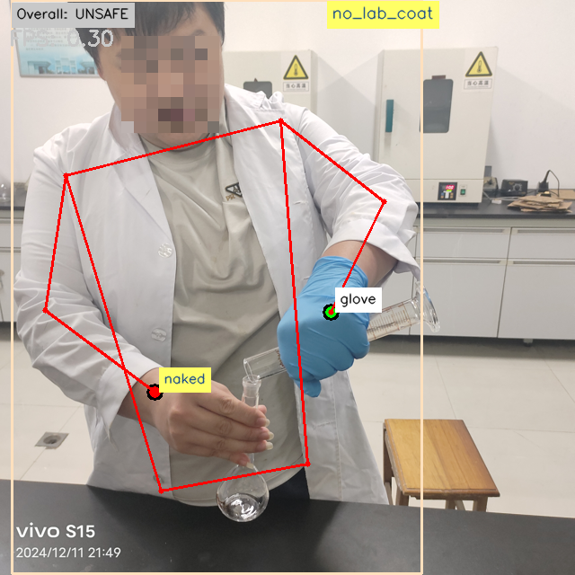
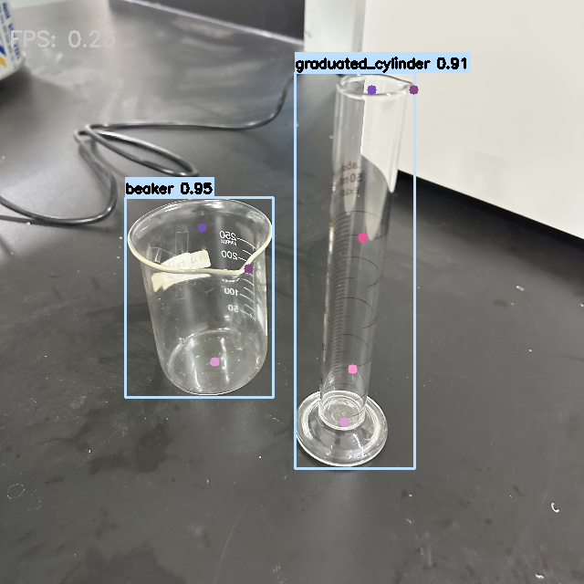

<h1>Chemistry Lab Detection System 🔬</h1>

A computer vision system for real-time detection and analysis of laboratory vessels and equipment.

<h2>Project Overview ✨</h2>

This project employs a cascade detection approach to identify laboratory vessels and determine their pose/orientation. The system utilizes <b>two-stage detection</b>:
<ol>
  <li>First detecting the vessel's boundary box</li>
  <li>Then analyzing the vessel's precise pose and orientation</li>
</ol>

<h2>Project Structure 📁</h2>

<pre style="font-size:13px;">
Chem_Lab_detect/
├── models/                  # Trained ML models
├── safety_detect/           # Safety detection (glove/naked_hand, lab_coat)
├── vessel_detect/           # Vessel detection (vessel_bbox, vessel_cascade)
├── chem_lab_agent/          # LLM agent for chemical lab operations (Q&amp;A)
├── utils/                   # Utility functions (drawing)
└── examples/                # Examples to debug on
</pre>

<h2>Results Display 🎉</h2>

  
  
Safety detection result example

  
  
Vessel pose detection result example

