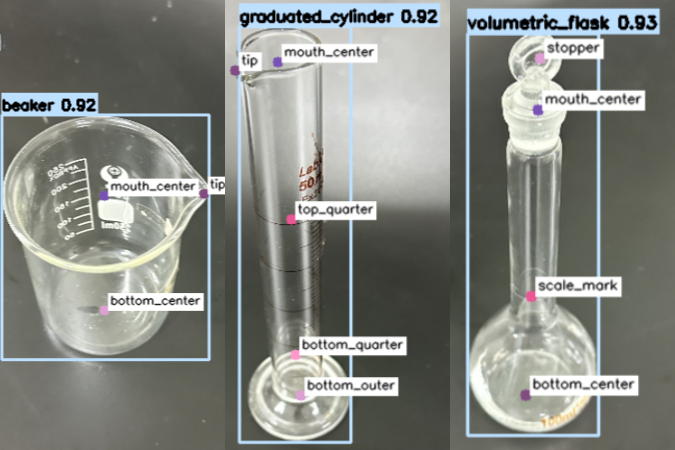
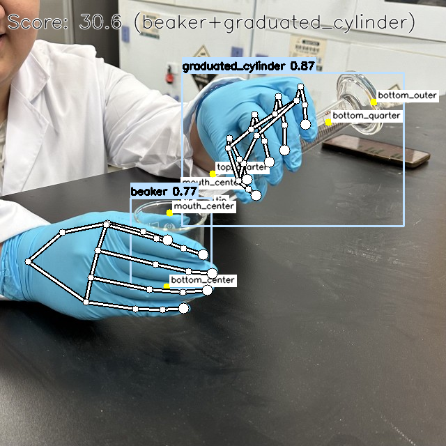

# Chemistry Lab Detection System 🔬

[](https://wakatime.com/badge/user/9af6799e-0454-4009-b789-fb07d1e221c3/project/b2a58f2a-facb-4d07-b388-e3dd5966933d)

A computer vision system for real-time detection and analysis of laboratory vessels and equipment.

## Project Overview ✨

Modules and pipelines for chemical laboratory experiment monitoring.

**Thread 1: Safety Detection**
- Safety gear detection (gloves, lab coats)

**Thread 2: Score Pipeline**
- **Gesture Detection**: MediaPipe hand tracking
- **Vessel Detection**: 
  - Bounding box model for vessel localization and cropping
  - Pose model for keypoint detection
  - Post-processing for keypoint correction
- **Action Scoring**: XGBoost-based operation evaluation

*Recommended to use frame sampling for optimal performance.*

## Project Structure 📁

```
Chem_Lab_detect/
├── models/                  # Trained ML models
├── safety_detect/           # Safety detection (glove/naked_hand, lab_coat)
├── vessel_detect/           # Vessel detection (vessel_cascade, keypoints_corrector)
├── xgboost_scorer/          # Action scoring (Pour between two vessels)
├── chem_lab_agent/          # LLM agent for chemical lab operations (Q&A)
├── debug/                   # debug modules on test images
├── utils/                   # Utility functions (drawing)
└── examples/                # Examples to debug on
```

## Results Display 🎉


<p><em>Safety detection result example</em></p>


<p><em>Vessel keypoints detection result example</em></p>


<p><em>Action score result example</em></p>