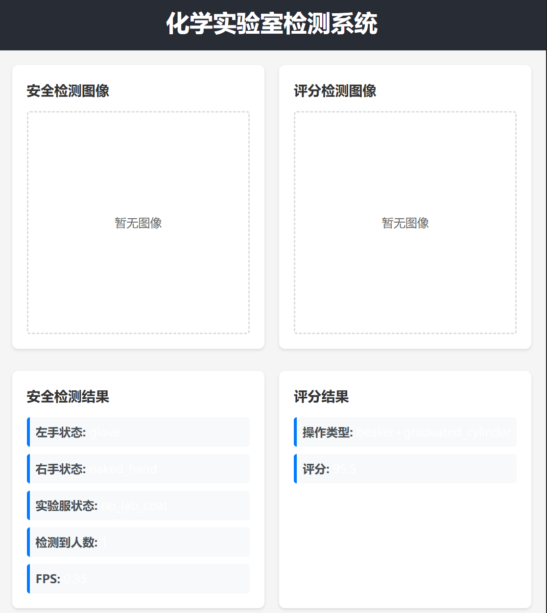

# Chem Lab Detect Fork (Vite + React + TS)

> This is a quick Vite + React + TypeScript implementation for the main branch.  
> [click to view **Main branch**](https://github.com/gugugaaa/Chem_Lab_detect/tree/main)

## Overview

- `/api/safety_result/`: Get safety detection result
- `/api/score_result/`: Get scoring detection result
- `/api/safety_image/`: Get safety detection image (base64)
- `/api/score_image/`: Get scoring detection image (base64)
> Detection is controlled by loop frame sampling, adjustable for higher FPS

## Frontend Layout

- Left: safety detection image  
- Right: scoring detection image  
- Bottom: detection results
- Fetch data from the above endpoints

    

