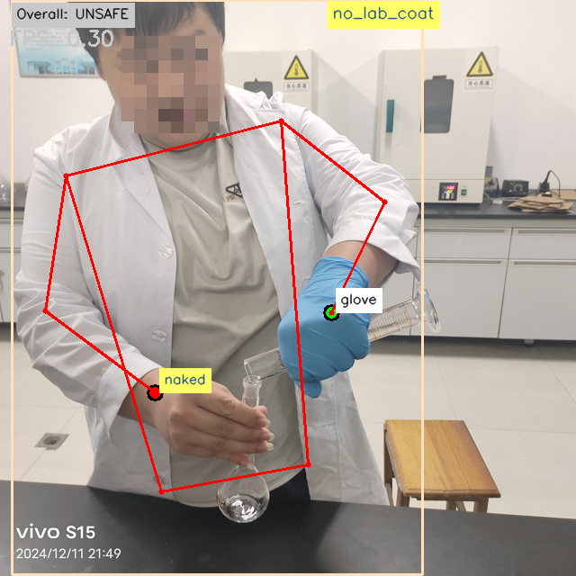
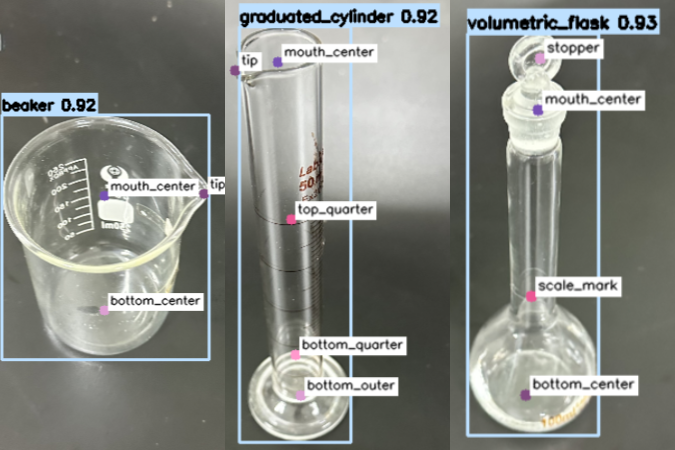
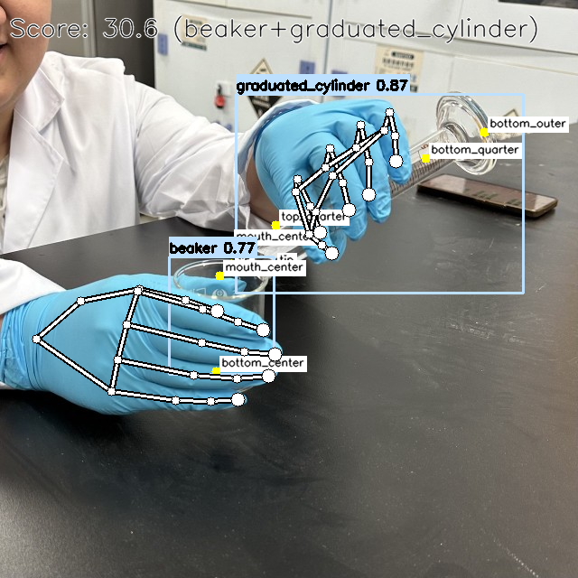

# Chem_Lab_detect

为化学实验仪器和操作实时检测和评分

## 概述

系统流程如下:

**Thread 1: 安全检测**
- 穿着安全 (手套, 实验服)

**Thread 2: 评分方法**
- **手势识别**: 为实验手套设计,特殊版本 MediaPipe
- **仪器检测**: 
  - 获得容器bbox, 识别并裁切
  - 填充裁切结果, 识别pose
  - 根据规则矫正遮挡/异常pose点
- **动作评分**: XGBoost模型打分

*边缘设备上, 建议降低分辨率到 320.*

视频流边缘部署示例见 `examples/video_frame_sampling.py`：默认每 5 帧执行一次检测，
中间帧复用最近一次检测可视化结果，降低连续视频推理开销。

```bash
python examples/video_frame_sampling.py --source camera --detector safety --frame-interval 5 --width 320
python examples/video_frame_sampling.py --source input.mp4 --detector score --output output.mp4 --no-display
```


[点击查看 **接口文档**](debug/interface_info.md)

## 效果展示



安全检测效果



容器关键点检测



动作评分


## 文件结构

```
Chem_Lab_detect/
├── models/                  # Trained ML models
├── safety_detect/           # Safety detection (glove/naked_hand, lab_coat)
├── vessel_detect/           # Vessel detection (vessel_cascade, keypoints_corrector)
├── xgboost_scorer/          # Action scoring (Pour between two vessels)
├── chem_lab_agent/          # LLM agent for chemical lab operations (Q&A)
├── debug/                   # debug modules on test images
├── utils/                   # Utility functions (drawing)
└── examples/                # Examples to debug on
```


## 应用


[点击查看 **一个简单的前端版本**](https://github.com/gugugaaa/Chem_Lab_detect/tree/react-gui)

---

under [MIT License](LICENSE)
